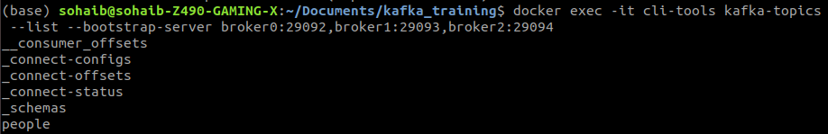
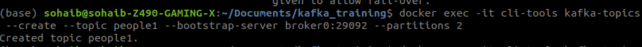
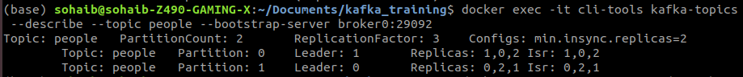
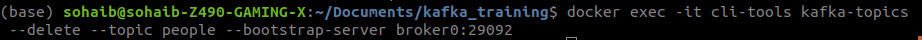

# KAFKA Kick Start
Kafka is real time event driven application. If you want to stream something realtime like uber shows you realtime location of a car or you can see status of your order on any ecommerce site in real time. Kafka can be used their. 


## Installation
1. You need to install docker and docker compose,
2. You just need to download the file [docker file](docker-compose.yml) 
3. Enter this command in terminal ```docker-compose up -d```
4. To check if your kafka things are running enter command ```docker-compose ps```

## Kakfa Commands
**List kafka Topics**

```bash
docker exec -it cli-tools kafka-topics --list --bootstrap-server broker0:29092,broker1:29093,broker2:29094
```

**Create Kafka Topics**
```bash
docker exec -it cli-tools kafka-topics --create --topic people1 --bootstrap-server broker0:29092 --partitions 2
```

**Get Information of Topic**
```bash
docker exec -it cli-tools kafka-topics --describe --topic people --bootstrap-server broker0:29092
```

**Delete topic**
```bash
docker exec -it cli-tools kafka-topics --delete --topic people --bootstrap-server broker0:29092
```
