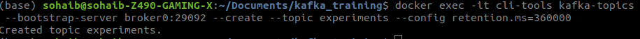
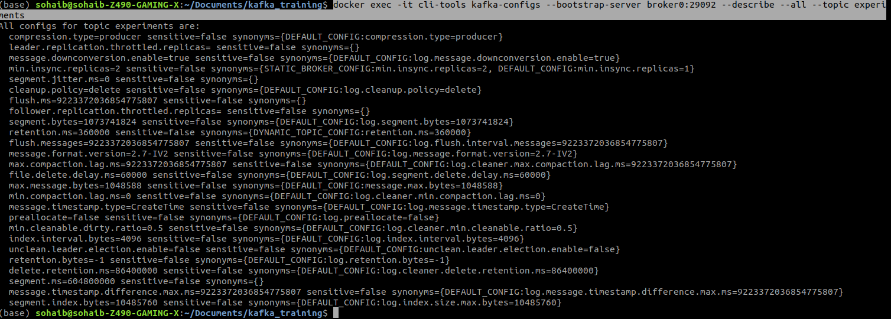
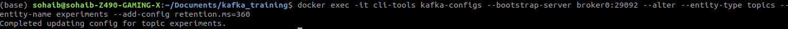
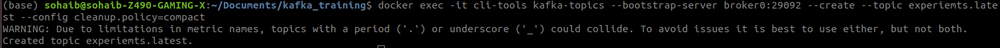

# KAFKA Kick Start
Kafka is real time event driven application. If you want to stream something realtime like uber shows you realtime location of a car or you can see status of your order on any ecommerce site in real time. Kafka can be used their. 


## Installation
1. You need to install docker and docker compose,
2. You just need to download the file [docker file](docker-compose.yml) 
3. Enter this command in terminal ```docker-compose up -d```
4. To check if your kafka things are running enter command ```docker-compose ps```

## Kakfa Commands
**List kafka Topics**

```bash
docker exec -it cli-tools kafka-topics --list --bootstrap-server broker0:29092,broker1:29093,broker2:29094
```

**Create Kafka Topics**
```bash
docker exec -it cli-tools kafka-topics --create --topic people1 --bootstrap-server broker0:29092 --partitions 2
```

**Get Information of Topic**
```bash
docker exec -it cli-tools kafka-topics --describe --topic people --bootstrap-server broker0:29092
```

**Delete topic**
```bash
docker exec -it cli-tools kafka-topics --delete --topic people --bootstrap-server broker0:29092
```


## Advance Topic Creation
In advance topic creation we can change the config of topics we make in kafka for-example for how long messages will stay in kafka that is called retention.

**Change Retention Time**

Change the timelimit of message saved in Kafka by default its 2 weeks
```bash
docker exec -it cli-tools kafka-topics --bootstrap-server broker0:29092 --create --topic experiments --config retention.ms=360000
```


**See all Configurations of topics**

View topic configration

```bash
docker exec -it cli-tools kafka-configs --bootstrap-server broker0:29092 --describe --all --topic experiments
```


**Update Topics Config**
If you want to update the config of already created topics you can do so by the command below

```bash
docker exec -it cli-tools kafka-configs --bootstrap-server broker0:29092 --alter --entity-type topics --entity-name experiments --add-config retention.ms=360
```


**Create compact Topics**
If you want to create compact topics you can use this command
```bash
docker exec -it cli-tools kafka-configs --bootstrap-server broker0:29092 --alter --entity-type topics --entity-name experiments --add-config retention.ms=360
```


**Time base retention**
Time-based retention is specified by setting the cleanup.policy to delete and setting the retention.ms to some number of milliseconds. With this set, events will be kept in the topics at least until they have reached that time limit. Once they have hit that limit, they may not be deleted right away. This is because event deletion happens at the segment level. A segment will be marked for deletion once its youngest event has passed the time threshold.

**Compact Topics**
Unlike the retention policy criteria, where Kafka automatically removes messages from Kafka servers when the time or size is reached, you can clean up messages manually with the help of the Log Compaction Process. In other words, using the log compaction method, you can selectively remove messages from each topic partition where the records are replicated or present more than once. 